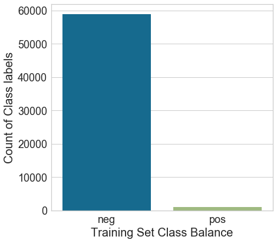
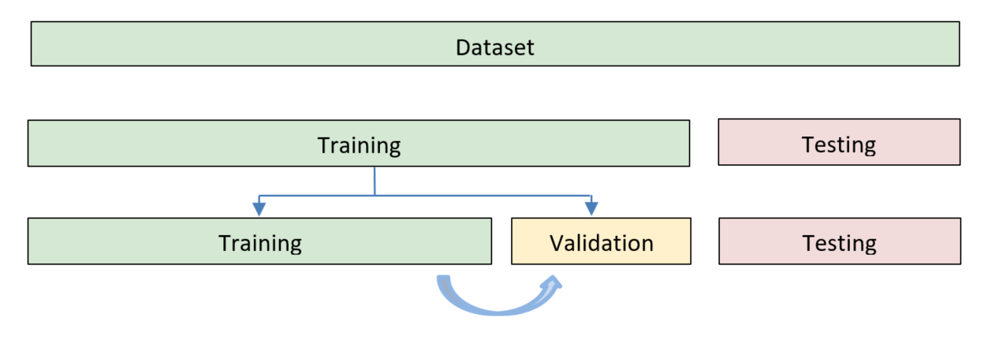
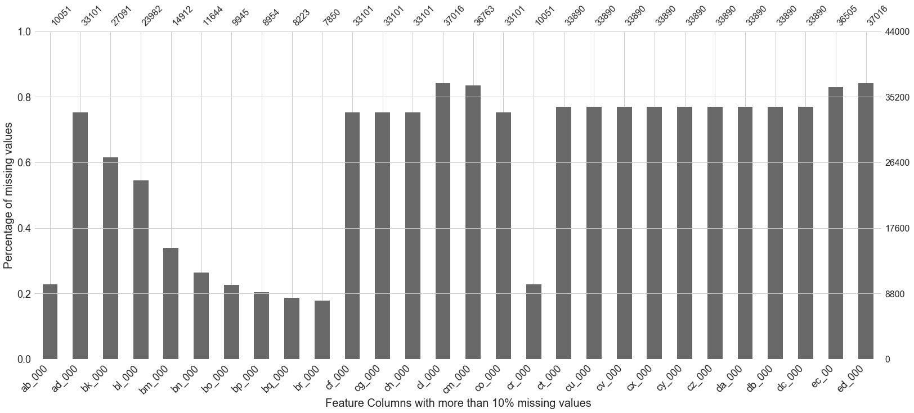
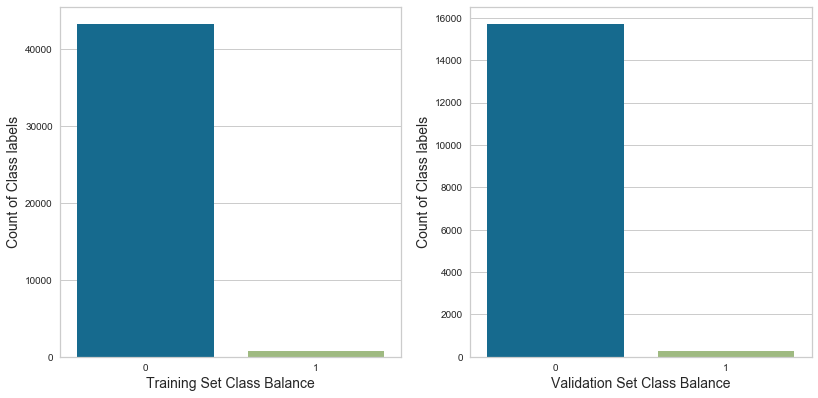
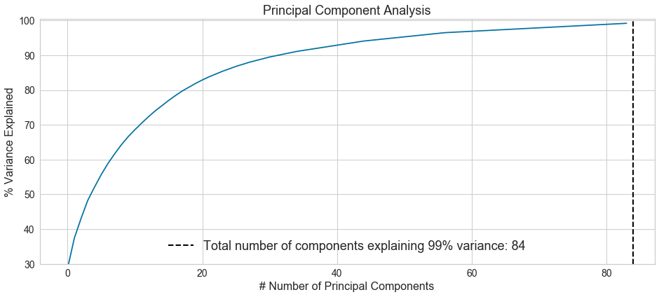
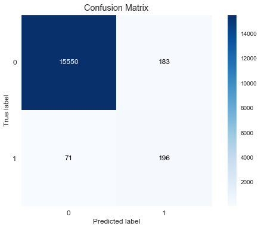
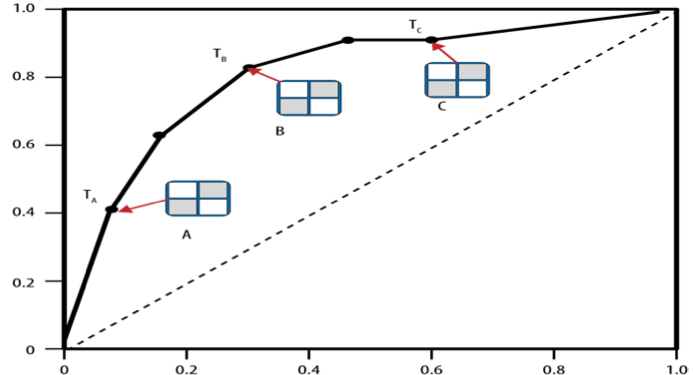
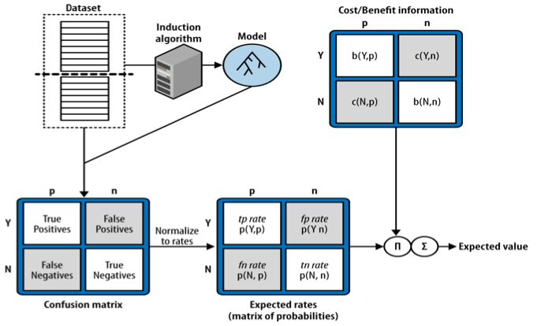
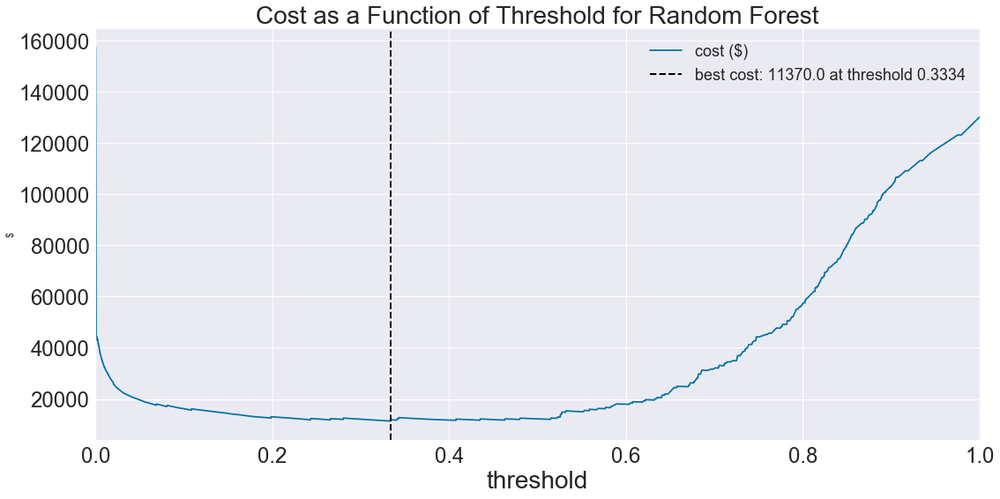
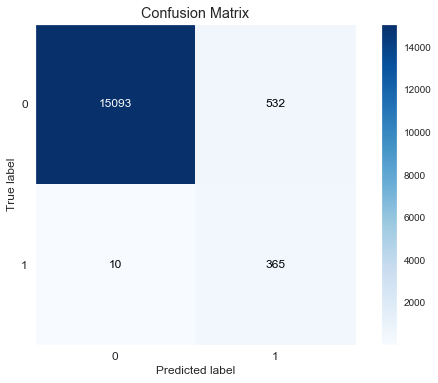

# APS Failure in SCANIA Truck Dataset

<p>The data set consists of values collected from several components of heavy Scania trucks from their daily usage. The sample data collected has been done by several experts and the component names are anonymized for proprietary reasons. The vehicles such as heavy Scania trucks that are operated on daily basis are key contributors in transportation, construction and many such industrial sectors. Therefore, it is of high priority that these trucks are maintained properly in order to avoid sudden breakdown that can amount to significant loss.</p>

<p>The key component of heavy Scania trucks that is in focus is the Air pressure system (APS) that is utilized in variety of tasks such as braking and shifting of gears. This makes it a crucial component and an ideal case for predictive maintenance where failures should be predicted before they occur. Data provided consists of training and test instances. The training set has 60000 samples and the testing set consists of 16000 samples with 170 feature columns.</p>


<p>Instances in training and testing set contains a class label positive or negative and this enables us to model this problem using a supervised classification approach. The positive labelled instances denote the failure due to APS component while the negative labelled instances denote the trucks with failure due to components other than APS. The data set has a lot missing values and contains numerical as well as histogram bins of temperature values.</p>

<p>Predictive model has to be built to judge if a vehicle faces failure imminently due to APS component. A cost function was given to quantify the misclassification rate of the predictive model.</p>

The cost function is described as follows:

\begin{equation*}
    Total Misclassification Cost=10*FP+500*FN
\end{equation*}

Where 
<ul>
    <li>False positive($FP$)  --Machine failed due other components but misclassified as failure due to APS</li>
    <li>False negative($FN$) -- Machine failed due to APS system but was misclassified as failure due to components other than APS</li>
<ul>


```python
# pandas and numpy for data manipulation
import pandas as pd
import numpy as np

# matplotlib and seaborn for plotting
# Library for plotting the missing values in the dataset
import missingno as msno
import matplotlib.pyplot as plt
%matplotlib inline  
import seaborn as sns
import scikitplot as skplt

plt.style.use('fivethirtyeight')

#Image for displaying disk images
from IPython.display import Image

#set the random seed
np.random.seed(1234)
# Suppress warnings from pandas
import warnings
warnings.filterwarnings('ignore')
```


```python
# Importing the necessary libraries from sklearn and yellowbrick
from sklearn import metrics
from sklearn import model_selection
from sklearn.ensemble import RandomForestClassifier
from sklearn.model_selection import RandomizedSearchCV,train_test_split
from sklearn.metrics import matthews_corrcoef
from pprint import pprint
from sklearn.preprocessing import StandardScaler
from sklearn.decomposition import PCA
from sklearn.metrics import roc_auc_score, roc_curve, auc
from sklearn.metrics import precision_recall_curve, average_precision_score
from yellowbrick.classifier import ROCAUC
```


```python
#Read in the Data Train and Test Set.
train_df = pd.read_csv("aps_failure_training_set.csv")
test_df = pd.read_csv("aps_failure_test_set.csv")
```


```python
train_df.head()
```


<div>
<style scoped>
    .dataframe tbody tr th:only-of-type {
        vertical-align: middle;
    }

    .dataframe tbody tr th {
        vertical-align: top;
    }

    .dataframe thead th {
        text-align: right;
    }
</style>
<table border="1" class="dataframe">
  <thead>
    <tr style="text-align: right;">
      <th></th>
      <th>class</th>
      <th>aa_000</th>
      <th>ab_000</th>
      <th>ac_000</th>
      <th>ad_000</th>
      <th>ae_000</th>
      <th>af_000</th>
      <th>ag_000</th>
      <th>ag_001</th>
      <th>ag_002</th>
      <th>...</th>
      <th>ee_002</th>
      <th>ee_003</th>
      <th>ee_004</th>
      <th>ee_005</th>
      <th>ee_006</th>
      <th>ee_007</th>
      <th>ee_008</th>
      <th>ee_009</th>
      <th>ef_000</th>
      <th>eg_000</th>
    </tr>
  </thead>
  <tbody>
    <tr>
      <th>0</th>
      <td>neg</td>
      <td>76698</td>
      <td>na</td>
      <td>2130706438</td>
      <td>280</td>
      <td>0</td>
      <td>0</td>
      <td>0</td>
      <td>0</td>
      <td>0</td>
      <td>...</td>
      <td>1240520</td>
      <td>493384</td>
      <td>721044</td>
      <td>469792</td>
      <td>339156</td>
      <td>157956</td>
      <td>73224</td>
      <td>0</td>
      <td>0</td>
      <td>0</td>
    </tr>
    <tr>
      <th>1</th>
      <td>neg</td>
      <td>33058</td>
      <td>na</td>
      <td>0</td>
      <td>na</td>
      <td>0</td>
      <td>0</td>
      <td>0</td>
      <td>0</td>
      <td>0</td>
      <td>...</td>
      <td>421400</td>
      <td>178064</td>
      <td>293306</td>
      <td>245416</td>
      <td>133654</td>
      <td>81140</td>
      <td>97576</td>
      <td>1500</td>
      <td>0</td>
      <td>0</td>
    </tr>
    <tr>
      <th>2</th>
      <td>neg</td>
      <td>41040</td>
      <td>na</td>
      <td>228</td>
      <td>100</td>
      <td>0</td>
      <td>0</td>
      <td>0</td>
      <td>0</td>
      <td>0</td>
      <td>...</td>
      <td>277378</td>
      <td>159812</td>
      <td>423992</td>
      <td>409564</td>
      <td>320746</td>
      <td>158022</td>
      <td>95128</td>
      <td>514</td>
      <td>0</td>
      <td>0</td>
    </tr>
    <tr>
      <th>3</th>
      <td>neg</td>
      <td>12</td>
      <td>0</td>
      <td>70</td>
      <td>66</td>
      <td>0</td>
      <td>10</td>
      <td>0</td>
      <td>0</td>
      <td>0</td>
      <td>...</td>
      <td>240</td>
      <td>46</td>
      <td>58</td>
      <td>44</td>
      <td>10</td>
      <td>0</td>
      <td>0</td>
      <td>0</td>
      <td>4</td>
      <td>32</td>
    </tr>
    <tr>
      <th>4</th>
      <td>neg</td>
      <td>60874</td>
      <td>na</td>
      <td>1368</td>
      <td>458</td>
      <td>0</td>
      <td>0</td>
      <td>0</td>
      <td>0</td>
      <td>0</td>
      <td>...</td>
      <td>622012</td>
      <td>229790</td>
      <td>405298</td>
      <td>347188</td>
      <td>286954</td>
      <td>311560</td>
      <td>433954</td>
      <td>1218</td>
      <td>0</td>
      <td>0</td>
    </tr>
  </tbody>
</table>
<p>5 rows × 171 columns</p>
</div>


### We can infer from the initial description of training dataset that there are a lot of missing values and are inaccurately represented. We shall replace the na values with np.nan across both the datasets


```python
train_df.replace('na',np.nan,inplace = True)
test_df.replace('na',np.nan,inplace = True)
```


```python
# Let's the visualize the target variable distribution across the training dataset
#Define the figure and axis 
fig, ((ax1)) =  plt.subplots(nrows=1, ncols=1) 
fig.set_size_inches(6,6)

# plot a simple countplot to get the target variable distribution
ax1=sns.countplot(x=train_df["class"])
ax1.tick_params(labelsize=18)
ax1.set_xlabel('Training Set Class Balance',fontsize=20)
ax1.set_ylabel('Count of Class labels',fontsize=20)
plt.savefig('images/trainClassbalance.png', transparent=False, dpi=80, bbox_inches="tight");
```





### We can the training dataset contains highly imbalanced target variable distribution with 98% values belonging to the negative class and just 2% of values belonging to the positive class


```python
# The target variable is labelled as 'class'. We will pop it out of the dataframe and store in a series
y = train_df.pop("class")
y_test = test_df.pop("class")

```


```python
X = train_df.copy()
X_test = test_df.copy()
```

### The class lables are being denoted as 'neg' and 'pos' in the original dataset. We shall convert to values 0 and 1 for the purpose of binary classification

### The class '0' represents trucks with failures for components not related to the APS and class '1' represents trucks with component failures for a specific component of the APS system.


```python
y.replace('neg',0,inplace=True)
y.replace('pos',1,inplace=True)

y_test.replace('neg',0,inplace=True)
y_test.replace('pos',1,inplace=True)
```



<p> The training dataset will be split further into training and validation set. As we saw earlier that the dataset is highly imbalanced, we will be trying some of the sampling techniques to generate synthetic samples for the modle to train with a balanced target variable distribution.<p>


<a href =https://www.marcoaltini.com/blog/dealing-with-imbalanced-data-undersampling-oversampling-and-proper-cross-validation>Marcoaltini's Blog page</a><p> The author explains the possiblity of data leakage. Data leakage can occur during cross validation procedures when oversampling the data first and then splitting in to train and validation set. </p>


<h3> In order to avoid the data leakage possibility and also have a unbiased estimation of trained model on a validation set before getting the misclassfication cost on the test, we shall split the training dataset into train and validation set by keeping the target distribution similar using the stratified split</h3>


```python
X_train, X_val, y_train, y_val = train_test_split(
    X, y, test_size=16000,stratify = y ,random_state=42)
```

### Missing Values - Exploration 


```python
#Lets get the shape and column names of the train data
rows,cols =X_train.shape
column_names = X_train.columns.values.tolist()
```


```python
# We can from previous line of code that the data appears to have a lot of missing values
# Lets get the missing values across the entire dataset - rows and cols
nan_count = X_train.isnull().sum()
nan_count.head(5)
```


    aa_000        0
    ab_000    33949
    ac_000     2444
    ad_000    10899
    ae_000     1820
    dtype: int64


```python
# It appears that almost all columns have some amount of missing values
# Lets get the average number of missing values across all the columns and rows
# It will let us know the percentage of missing values across the columns
nan_values = nan_count.values
avg_nan_per_col = nan_values/rows
avg_nan_per_col
```


    array([0.        , 0.77156818, 0.05554545, 0.24770455, 0.04136364,
           0.04136364, 0.01065909, 0.01065909, 0.01065909, 0.01065909,
           0.01065909, 0.01065909, 0.01065909, 0.01065909, 0.01065909,
           0.01065909, 0.01065909, 0.01045455, 0.01045455, 0.07329545,
           0.01059091, 0.01045455, 0.01059091, 0.00988636, 0.01059091,
           0.00988636, 0.04529545, 0.01045455, 0.01045455, 0.01045455,
           0.04138636, 0.04140909, 0.01063636, 0.01063636, 0.01063636,
           0.01063636, 0.01063636, 0.01063636, 0.01063636, 0.01063636,
           0.01063636, 0.01063636, 0.01063636, 0.01063636, 0.01063636,
           0.01063636, 0.01063636, 0.01063636, 0.01063636, 0.01063636,
           0.01063636, 0.01063636, 0.01095455, 0.01095455, 0.01095455,
           0.01095455, 0.01095455, 0.01095455, 0.01095455, 0.01095455,
           0.01095455, 0.01095455, 0.01065909, 0.04531818, 0.04534091,
           0.04138636, 0.04136364, 0.01059091, 0.01059091, 0.00988636,
           0.00988636, 0.38429545, 0.45495455, 0.66109091, 0.73536364,
           0.77397727, 0.7965    , 0.81311364, 0.82159091, 0.01197727,
           0.00263636, 0.01138636, 0.01138636, 0.05422727, 0.00756818,
           0.04529545, 0.07245455, 0.01197727, 0.05418182, 0.01118182,
           0.04140909, 0.24770455, 0.24770455, 0.24770455, 0.00577273,
           0.00577273, 0.00577273, 0.15872727, 0.16447727, 0.01093182,
           0.01093182, 0.01093182, 0.01093182, 0.01093182, 0.01093182,
           0.01093182, 0.01093182, 0.01093182, 0.01093182, 0.24770455,
           0.04529545, 0.01138636, 0.77156818, 0.01061364, 0.01061364,
           0.01061364, 0.01061364, 0.01061364, 0.01061364, 0.01061364,
           0.01061364, 0.01061364, 0.01061364, 0.22977273, 0.22977273,
           0.22977273, 0.22977273, 0.22977273, 0.22977273, 0.22977273,
           0.22977273, 0.22977273, 0.04140909, 0.04531818, 0.06697727,
           0.06697727, 0.06695455, 0.06693182, 0.06695455, 0.06695455,
           0.06695455, 0.06697727, 0.01138636, 0.04529545, 0.04531818,
           0.04531818, 0.04534091, 0.04534091, 0.04534091, 0.04534091,
           0.04534091, 0.04529545, 0.04529545, 0.04529545, 0.04529545,
           0.06695455, 0.17034091, 0.15872727, 0.01063636, 0.01063636,
           0.01063636, 0.01063636, 0.01063636, 0.01063636, 0.01063636,
           0.01063636, 0.01063636, 0.01063636, 0.04529545, 0.04529545])


```python
'''
Typical tolerance level of missing values beyond which any imputation will lead to skewed response
are between 10 -15%
10% of missing values in this dataset of 60000 leads to columns with atleast 6000 missing values

'''
nan_count[nan_count.values > 6000]
```


    ab_000    33949
    ad_000    10899
    bk_000    16909
    bl_000    20018
    bm_000    29088
    bn_000    32356
    bo_000    34055
    bp_000    35046
    bq_000    35777
    br_000    36150
    cf_000    10899
    cg_000    10899
    ch_000    10899
    cl_000     6984
    cm_000     7237
    co_000    10899
    cr_000    33949
    ct_000    10110
    cu_000    10110
    cv_000    10110
    cx_000    10110
    cy_000    10110
    cz_000    10110
    da_000    10110
    db_000    10110
    dc_000    10110
    ec_00      7495
    ed_000     6984
    dtype: int64


```python
# Let's get the number of columns that have more than 10% percent missing values
print( " The number of columns with more than 10% missing values is {}".format(len(nan_count[nan_count.values > 6000])))
```

     The number of columns with more than 10% missing values is 28


```python
# Let's the visulaize these 28 columns with more than 10% missing values

# Missingno library is used. If library not present - pls run pip install missingno

tenpercentnan =nan_count[nan_count.values > 6000]
fig = plt.figure(figsize= (16,16))
ax1 =msno.bar(X_train[tenpercentnan.index])
ax1.tick_params(labelsize=18)
ax1.set_xlabel('Feature Columns with more than 10% missing values',fontsize=20)
ax1.set_ylabel('Percentage of missing values',fontsize=20)
plt.savefig('images/TrainingSetMissingvaluecolumns.png', transparent=False, dpi=80, bbox_inches="tight") 

```


    <matplotlib.figure.Figure at 0x1174b7828>





```python
# let's crosscheck that we are indeed removing the 28 columns that have more than 10% missing values
count =0
for col in range(cols):
    if nan_count[col] > 6000:
        count +=1

print(count)
```

    28


```python
tenpercentnan.index
```


    Index(['ab_000', 'ad_000', 'bk_000', 'bl_000', 'bm_000', 'bn_000', 'bo_000',
           'bp_000', 'bq_000', 'br_000', 'cf_000', 'cg_000', 'ch_000', 'cl_000',
           'cm_000', 'co_000', 'cr_000', 'ct_000', 'cu_000', 'cv_000', 'cx_000',
           'cy_000', 'cz_000', 'da_000', 'db_000', 'dc_000', 'ec_00', 'ed_000'],
          dtype='object')


### Let's the drop the columns with more than 10% missing values across the train, validation and test sets


```python
# Get the index from nan_count with more than 6000 values and make an inplace drop on the training set
X_train.drop(X_train[nan_count[nan_count.values > 6000].index],1,inplace=True)

# Let's check the shape of the training dataset
print("The shape of new training dataset is {}".format(X_train.shape))

```

    The shape of new training dataset is (44000, 142)


```python
# Get the index from nan_count with more than 6000 values and make an inplace drop on the validation set
X_val.drop(X_val[nan_count[nan_count.values > 6000].index],1,inplace=True)

# Let's check the shape of the validation dataset
print("The shape of new training dataset is {}".format(X_val.shape))

```

    The shape of new training dataset is (16000, 142)


```python
# Get the index from nan_count with more than 6000 values and make an inplace drop on the testing set
X_test.drop(X_test[nan_count[nan_count.values > 6000].index],1,inplace=True)

# Let's check the shape of the Test dataset
print("The shape of new training dataset is {}".format(X_test.shape))
```

    The shape of new training dataset is (16000, 142)


```python
# Get the new shape again
rows,cols =X_train.shape
column_names = X_train.columns.values.tolist()
'''
The columns with more than 10% missing values has been removed across the train, validation and the test datasets
The remaining missing values will be replaced with median values. Future experiments can be made with computationally 
extensive imputation techniques like knn imputation etc
'''

for column in column_names:
    X_train[column].fillna(X_train[column].median(),inplace= True)
    X_val[column].fillna(X_val[column].median(),inplace= True)
    X_test[column].fillna(X_test[column].median(),inplace=True)
    # Because of Nan values , columns were of object pandas type
    # After median imputation - they become numeric - so we can change it to float type
    if X_train[column].dtype =='object':
        X_train[column]= X_train[column].astype(float)
        X_val[column]= X_val[column].astype(float)
        X_test[column]=X_test[column].astype(float)

```

### The training set is highly imbalanced. We shall perform oversampling of the minority class using SMOTE
#### Let's Check the class distribution across training and validation set before we perform oversampling


```python
# Training and validation set target class distribution
fig, (ax1,ax2) =  plt.subplots(nrows=1, ncols=2) 
fig.set_size_inches(12,6)

sns.countplot(x=y_train,ax=ax1)
ax1.tick_params(labelsize=10)
ax1.set_xlabel('Training Set Class Balance',fontsize=14)
ax1.set_ylabel('Count of Class labels',fontsize=14)

sns.countplot(x=y_val,ax=ax2)
ax2.tick_params(labelsize=10)
ax2.set_xlabel('Validation Set Class Balance',fontsize=14)
ax2.set_ylabel('Count of Class labels',fontsize=14)
plt.savefig('images/Classbalance.png', transparent=False, dpi=80, bbox_inches="tight") 
```





<p> The dataset still has a high dimensionality problem as there are 142 columns. In order to perform PCA, We shall first perform standardization of columns across the training , validation and testing set , followed by oversampling using SMOTE and then PCA </p>

### Z-Score Normalization of the training, validation and testing set


```python
#Initialize the standard scaler 
stdscale = StandardScaler()

#Fit the standardscaler to training set
stdscale.fit(X_train)
```


    StandardScaler(copy=True, with_mean=True, with_std=True)


```python
# Get the columns of the training set
feat =X_train.columns
```


```python
# Make a copy of the training dataframe
scld_data= X_train.copy()

# Using the fitted standarscaler transform the training dataframe into normalized dataframe
scld_data[feat] = stdscale.transform(X_train[feat])
```


```python
# Make a copy of the validation dataframe
scld_val = X_val.copy()

# Using the fitted standarscaler transform the validation dataframe into normalized dataframe
scld_val[feat] = stdscale.transform(X_val[feat])
```


```python
# Make a copy of the testing dataframe
scld_test  = X_test.copy()

# Using the fitted standarscaler transform the testing dataframe into normalized dataframe
scld_test[feat] = stdscale.transform(X_test[feat])
```

<p>In order to handle the class imbalance in our data set, we oversample the minority instances in the data set which are represented by positively labelled classes. The most common techniques used to oversample the data set is referred to as SMOTE(Synthetic Minority Oversampling Technique).It is a technique that generates new instances of the minority class so as to balance the data set. However, SMOTE does not randomly create duplicates of the minority samples that already exist in the data set. The following equation from depicts the way SMOTE generates synthetic samples. </p>

\begin{equation*}
  xnew =xi +λ∗(xzi −xi)
\end{equation*}


<p>SMOTE takes a minority instance x_i from the data set and for a specified integer value k, it tries to choose k-nearest neighbors that belong the same class as xi using the Euclidean distance between them. An illustration of this process is shown in Fig .In order to create a synthetic instance x_new,it chooses one instance xzirandomly within the k-nearest neighbors , multiplies the feature space of chosen in- stance x_zi with a random number λ and adds it with the minority instance x_i.The value of λ lies in the range [0,1]

There are many different variants of SMOTE technique that can be implemented using imbalanced-learn library. Borderline2-SMOTE , one among the Borderline-SMOTE variant has been used to oversample the minority instances in our data set. Regular SMOTE , although does not randomly sample the minority instances , it does not take into consideration the closest majority instance samples when trying to identify the nearest neighbors. This can lead to overlapping of the minority instances by lying closer to the majority instances.</p>

<p>Borderline SMOTE 2 generates synthetic samples by applying the SMOTE algorithm, but only to samples that are near the border between different classes.Initially m nearest neighbours for every sample in the minority class are found. Minority samples that are completely surrounded by majority samples, i.e.: all m nearest neighbours belong to the majority class, are considered to be noise and left out of the process. Samples with at most m/2 NNs from the majority class are considered to be safe, and also left out of the process.</p>

<p>Samples for which the number of NNs from the majority class is greater than m<2 (but not m) are considered in danger (near the borderline) and used to generate synthetic samples. What differs Borderline SMOTE 2 from Borderline SMOTE 1 is that synthetic samples are created both from nearest minority neighbours as well as nearest majority neighbours. However, synthetic samples created from majority neighbours are created closer to the minority sample then when created from minority neighbours. </p>


```python
# The library used for implementing SMOTE is imblearn
from imblearn.over_sampling import SMOTE

#Import counter from collections to make count of oversampled data
from collections import Counter
```


```python
# Initialize the smote borderline2 variant
sm = SMOTE(random_state=42,kind='borderline2')
```


```python
# Fitting the initialized smote variant on the scaled training data
X_res, y_res = sm.fit_sample(scld_data, y_train)

# Print the oversampled training data target variable distribution
print('Resampled dataset shape {}'.format(Counter(y_res)))
```

    Resampled dataset shape Counter({0: 43267, 1: 43266})


### The train , validation and test after removing missing values and imputation is still high dimensional and has about 140 columns. The cols appear to be highly correalted and since the features are anonymised anyway, we will use pca to handle this dimensionality


```python
#Initialize the PCA to capture components that explain 99% variance of the training data

pca = PCA(.99)

#Fit the initialized pca on the oversample training data
pca.fit(X_res)

#calculate variance ratios
variance = pca.explained_variance_ratio_ 

# Get the explained variance for each of the components generated using pca
var=np.cumsum(np.round(pca.explained_variance_ratio_, decimals=3)*100)

#explained variance of each components chosen by pca
fig, ((ax1)) =  plt.subplots(nrows=1, ncols=1) 
fig.set_size_inches(14,6)
ax1.set_title('Principal Component Analysis',fontsize=18)

ax1.tick_params(labelsize=14)
ax1.set_xlabel('# Number of Principal Components',fontsize=16)
ax1.set_ylabel('% Variance Explained',fontsize=16)
ax1.set_ylim(30,100.5)
plt.style.context('seaborn-darkgrid')
ax1.plot(var)
label = 'Total number of components explaining 99% variance: {}'.format(len(var))
plt.axvline(len(var), linestyle = '--', lw = 2, color = 'black', label = label)
ax1.legend(prop={'size': 18},loc='bottom')
plt.savefig('images/PCA_Explained Variance.png', transparent=False, dpi=80, bbox_inches="tight")
```





```python
#Let's transform the oversample training data using PCA
X_train_pca =pca.transform(X_res)
y_train = y_res

# Let's check the shape of the training dataset
print("The shape of new training dataset is {}".format(X_train_pca.shape))
```

    The shape of new training dataset is (86533, 84)


```python
#Let's transform the validation data using PCA
X_val_pca = pca.transform(scld_val)
y_val = y_val.values
# Let's check the shape of the validation dataset
print("The shape of new validation dataset is {}".format(X_val_pca.shape))
```

    The shape of new validation dataset is (16000, 84)


```python
#Let's transform the testing data using PCA
X_test_pca = pca.transform(scld_test)
y_test = y_test.values

# Let's check the shape of the testing dataset
print("The shape of new testing dataset is {}".format(X_val_pca.shape))
```

    The shape of new testing dataset is (16000, 84)


```python
# Capture the ratio of target variable across the validation set
val_prob_pos =0.0166875
val_prob_neg =0.9833125
```

## Helper Functions


```python
def classifier_metrics(model,estimator,actual,y_pred,proba):
    # Calculating the classification metrics -
    # Input - model predicted values and probablilites
    class_metrics ={
                        'Accuracy' : metrics.accuracy_score(actual, y_pred),
                        'Precision' : metrics.precision_score(actual, y_pred),
                        'Recall' : metrics.recall_score(actual, y_pred),
                        'F1 Score' : metrics.f1_score(actual, y_pred),
                        'ROC AUC' : metrics.roc_auc_score(actual, proba),
                        'Matthews Correlation Coefficient': matthews_corrcoef(actual,y_pred)    
                      }

  
    df_metrics = pd.DataFrame.from_dict(class_metrics, orient='index')
    df_metrics.columns = [model]
    
    print('\n'+ model +'  Metrics:')
    
    print(df_metrics)
    # Calculating and displaying confusion matrix for each model
    print('\nConfusion Matrix:')
    skplt.metrics.plot_confusion_matrix(actual, y_pred)
    return  df_metrics
```

# Model Selection and Evaluation


```python
import pickle
import os
```

<h1>Random Forest</h1>


```python
if os.path.isfile('random_forest_finalized_model.sav'):
    clf_rf = pickle.load(open('random_forest_finalized_model.sav', 'rb'))
    print("Fitted random forest model has been loaded from pickle file. Run prediction on dataset")
else:
    print('Pickle object not found. Train the model and dump the fitted model using pickle')
```

    Fitted Logistic regression model has been loaded from pickle file. Run prediction on dataset


#### Run the following code cells if the pickle file is not available. If available proceed the code cell containing the predict method. Pickle dump is used to reduce the time constraint of running the gridsearch model tuning and training again


```python
model = 'Random Forest'

# Intialize the random forest model with class_weights = balanced, since we have oversampled the training set
clf_rf = RandomForestClassifier(n_estimators =10,oob_score = True,
                                random_state=123,class_weight="balanced",n_jobs=-1)
print('Parameters currently in use:\n')
pprint(clf_rf.get_params())
```

    Parameters currently in use:
    
    {'bootstrap': True,
     'class_weight': 'balanced',
     'criterion': 'gini',
     'max_depth': None,
     'max_features': 'auto',
     'max_leaf_nodes': None,
     'min_impurity_decrease': 0.0,
     'min_impurity_split': None,
     'min_samples_leaf': 1,
     'min_samples_split': 2,
     'min_weight_fraction_leaf': 0.0,
     'n_estimators': 10,
     'n_jobs': -1,
     'oob_score': True,
     'random_state': 123,
     'verbose': 0,
     'warm_start': False}


```python
# Fit baseline random forest model on the training data
clf_rf.fit(X_train_pca,y_train)
```


    RandomForestClassifier(bootstrap=True, class_weight='balanced',
                criterion='gini', max_depth=None, max_features='auto',
                max_leaf_nodes=None, min_impurity_decrease=0.0,
                min_impurity_split=None, min_samples_leaf=1,
                min_samples_split=2, min_weight_fraction_leaf=0.0,
                n_estimators=10, n_jobs=-1, oob_score=True, random_state=123,
                verbose=0, warm_start=False)


```python
# Let's predict the validation data using the fitted baseline model 
rf_val_baseline_pred = clf_rf.predict(X_val_pca) 

# capture the predicted probabilites for the fitted baseline model
rf_val_baseline_proba =clf_rf.predict_proba(X_val_pca)[:,1]

#Compute the classifier metrics for the baseline model prediction
rf_val_baseline_metric = classifier_metrics('RF Baseline',clf_rf, y_val,rf_val_baseline_pred,rf_val_baseline_proba)
```

    
    RF Baseline  Metrics:
                                      RF Baseline
    Accuracy                             0.984125
    Precision                            0.517150
    Recall                               0.734082
    F1 Score                             0.606811
    ROC AUC                              0.980146
    Matthews Correlation Coefficient     0.608549
    
    Confusion Matrix:





```python
#Calculate the baseline model misclassification cost
baseline_cost = (183*10) + (71*500)

#print the cost value for baseline model
print("The total misclassification cost for the baseline random foret model is {}".format(baseline_cost))
```

    The total misclassification cost for the baseline random foret model is 37330


# Cost Sensitive Learning

<p>Cost sensitive classification is a technique allows us to handle the imbalanced data and give better classifier predictions with one that suits the business requirements of data.The challenge in the data set to build a predictive model that minimizes the misclassification cost. This cost function allows the adjustment of the classification threshold towards the point where the desired misclassification cost value is achieved. The total misclassification cost should be minimal in this case.
Using the expected value equation we can translate our cost function to decide a threshold for the classifier where the cost is minimal.</p>


\begin{equation*}
Expected profit = p(p) · [p(Y|p) · b(Y,p) + p(N|p) · c(N,p)]+
p(n) · [p(N|n) · b(N,n) + p(Y|n) · c(Y,n)]
\end{equation*}


<div style="display:flex">
     <div style="flex:1;padding-right:5px;">
          
     </div>
     <div style="flex:1;padding-left:5px;">
          
     </div>
</div>

<p>The expected value equation takes into account the cost for true positive, false posi- tives, true negatives and false negatives predictions. The ROC AUC curve gives visualization of the change in roc auc score by representing the true positive rate and false positive rate for each threshold chosen by the classifier.In order to achieve this the probability estimates for the instances should be calculated. From the code listing shown below we can see that the roc curve gives the values of thresholds and the corresponding true positive rate , false positive rate at that threshold. Each threshold can be considered to have a confusion matrix consisting of the true positive, true negative, false positive and the false negative predictions the clas- sifier made on that threshold.</p>

<p>Multiplying the false positive rate with total true negative samples gives us the false positives made by the classifier and multiplying the false negative rate with true positives gives us the false negative errors made by the classifier. False negative rate can be calculated from the true positive rates given by the roc curve. The cost of false positive error is 10 and the cost of false negative error is 50.The cost value has been calculated for each threshold and function returns the value of best threshold that has the least misclassification cost value.<p>


```python
#Function call to find the classifier decision threshold that gives the lowest misclassification cost
def cost_threshold(Model,prop_negative,prob_positive,actual, pred_proba,xlim,location,title):
    
    # Calculate the false positive rate, true positive rate and thresholds from ROC-Curve
    fpr, tpr, thresholds = roc_curve(actual, pred_proba)
    
    #Calculate the false negative rate
    fnr = tpr[-1] - tpr
    
    #Set the cost value for false positives and false negatives
    fp_cost = 10
    fn_cost = 500
    
    #Calcuate the misclassification using the expected value equation
    costs = (prop_negative*actual.size)*(fpr * fp_cost) + (prob_positive*actual.size)*(fnr * fn_cost) 
    
    #Find the lowest cost values for all threshold values
    best = np.argmin(costs)
    
    # Find the threshold at which the lowest cost was achieved
    best_cost = np.round(costs[best])
    best_threshold = np.round(thresholds[best], 4)
    
    # Define a plot to visualize the change in misclassification cost a function of classifier threshold
    fig, axes = plt.subplots(figsize = (16, 8))
    
    #set to plot the threshold and cost along x and y axis
    axes.plot(thresholds, costs, label = 'cost ($)')
    
    #Generate labels to denote the best threshold and the cost value at that threshold
    label = 'best cost: {} at threshold {}'.format(best_cost, best_threshold)
    
    # Plot a verticle line to identify the point of lowest cost value
    plt.axvline(best_threshold, linestyle = '--', lw = 2, color = 'black', label = label)
    axes.set_xlim(xlim)
    axes.set_xlabel('threshold',fontsize= 28)  
    axes.set_ylabel('$')
    axes.tick_params(labelsize=24)
    
    #Set plot title and legend values
    axes.set_title('Cost as a Function of Threshold for '+Model,fontsize= 28)
    axes.legend(prop={'size': 18},loc=location)
    
    #Define the richness of plot output for saving to disk
    fig.savefig('images/smoteborderline2/'+title, transparent=False, dpi=80, bbox_inches="tight")
    return best_cost
```

### Define random forest parameters for hyper parameter tuning


```python
# Set the parameters for tuning the random forest model
# Number of trees in random forest
n_estimators = [50]
# Number of features to consider at every split
max_features = ['auto','sqrt','log2']
# Maximum number of levels in tree
max_depth = [15,25,30]
# Minimum number of samples required to split a node
min_samples_split = [ 8,10]
# Minimum number of samples required at each leaf node
min_samples_leaf = [8, 9]
# Method of selecting samples for training each tree

criterion = ['gini', 'entropy']
# Create the random grid
random_grid = {'n_estimators': n_estimators,
               'max_features': max_features,
               'max_depth': max_depth,
               'min_samples_split': min_samples_split,
               'min_samples_leaf': min_samples_leaf,
               'criterion': criterion}
```


```python
# Define the random search tuning for random forest model
rf_random = RandomizedSearchCV(estimator=clf_rf, param_distributions=random_grid,
                              n_iter = 30, scoring='roc_auc', 
                              cv = 5, verbose=0, random_state=42, n_jobs=-1,
                              return_train_score=False)
```


```python
#Fit the model for random search hyperparameter tuning
rf_random.fit(X_train_pca,y_train)
```


    RandomizedSearchCV(cv=5, error_score='raise',
              estimator=RandomForestClassifier(bootstrap=True, class_weight='balanced',
                criterion='gini', max_depth=None, max_features='auto',
                max_leaf_nodes=None, min_impurity_decrease=0.0,
                min_impurity_split=None, min_samples_leaf=1,
                min_samples_split=2, min_weight_fraction_leaf=0.0,
                n_estimators=100, n_jobs=-1, oob_score=True, random_state=123,
                verbose=0, warm_start=False),
              fit_params=None, iid=True, n_iter=30, n_jobs=-1,
              param_distributions={'n_estimators': [50], 'max_features': ['sqrt', 'log2'], 'max_depth': [15, 25, 30], 'min_samples_split': [8, 10], 'min_samples_leaf': [8, 9], 'criterion': ['gini', 'entropy']},
              pre_dispatch='2*n_jobs', random_state=42, refit=True,
              return_train_score=False, scoring='roc_auc', verbose=0)


```python
# Let's print the best estimator derived from the random search tuning
print('\nBest Estimator:\n',rf_random.best_estimator_)
```

    
    Best Estimator:
     RandomForestClassifier(bootstrap=True, class_weight='balanced',
                criterion='entropy', max_depth=30, max_features='sqrt',
                max_leaf_nodes=None, min_impurity_decrease=0.0,
                min_impurity_split=None, min_samples_leaf=8,
                min_samples_split=8, min_weight_fraction_leaf=0.0,
                n_estimators=50, n_jobs=-1, oob_score=True, random_state=123,
                verbose=0, warm_start=False)


```python
# Let's print the best parameters derived for random forest through randome search tuning
print("\nBest Parameters for Random Forest : {} \n".format(rf_random.best_params_))
clf_rf = rf_random.best_estimator_
```

    
    Best Parameters for Random Forest : {'n_estimators': 50, 'min_samples_split': 8, 'min_samples_leaf': 8, 'max_features': 'sqrt', 'max_depth': 30, 'criterion': 'entropy'} 
    


```python
# Store the random search cv results in a dataframe
rf_random_results = pd.DataFrame(rf_random.cv_results_).sort_values('mean_test_score', ascending = False)

#Drop unnecessary columns fromt the cv results dataframe and keep the mean test score on the cross validation set
rf_random_results.drop(['std_fit_time', 'mean_score_time', 'std_score_time', 'param_min_samples_split',
       'param_min_samples_leaf','params','param_criterion', 'split0_test_score', 'split1_test_score',
       'split2_test_score', 'split3_test_score', 'split4_test_score','rank_test_score'],1,inplace=True)

# Display the first few lines of the cv results
rf_random_results.head()
```


<div>
<style scoped>
    .dataframe tbody tr th:only-of-type {
        vertical-align: middle;
    }

    .dataframe tbody tr th {
        vertical-align: top;
    }

    .dataframe thead th {
        text-align: right;
    }
</style>
<table border="1" class="dataframe">
  <thead>
    <tr style="text-align: right;">
      <th></th>
      <th>mean_fit_time</th>
      <th>param_n_estimators</th>
      <th>param_max_features</th>
      <th>param_max_depth</th>
      <th>mean_test_score</th>
      <th>std_test_score</th>
    </tr>
  </thead>
  <tbody>
    <tr>
      <th>1</th>
      <td>84.465220</td>
      <td>50</td>
      <td>sqrt</td>
      <td>30</td>
      <td>0.999441</td>
      <td>0.000433</td>
    </tr>
    <tr>
      <th>14</th>
      <td>67.631151</td>
      <td>50</td>
      <td>sqrt</td>
      <td>25</td>
      <td>0.999441</td>
      <td>0.000433</td>
    </tr>
    <tr>
      <th>22</th>
      <td>79.717070</td>
      <td>50</td>
      <td>sqrt</td>
      <td>25</td>
      <td>0.999441</td>
      <td>0.000433</td>
    </tr>
    <tr>
      <th>9</th>
      <td>64.017406</td>
      <td>50</td>
      <td>sqrt</td>
      <td>15</td>
      <td>0.999439</td>
      <td>0.000391</td>
    </tr>
    <tr>
      <th>4</th>
      <td>64.447675</td>
      <td>50</td>
      <td>sqrt</td>
      <td>15</td>
      <td>0.999439</td>
      <td>0.000391</td>
    </tr>
  </tbody>
</table>
</div>


```python
# Let's predict the validation data using the tuned model 
rf_val_pred = clf_rf.predict(X_val_pca) 

# capture the predicted probabilites for the tuned model
rf_val_proba =clf_rf.predict_proba(X_val_pca)[:,1]

#Compute the classifier metrics for the tuned model prediction
rf_val_metric = classifier_metrics('RF Validation',clf_rf, y_val,rf_val_pred,rf_val_proba)
```

    
    RF Validation  Metrics:
                                      RF Validation
    Accuracy                               0.978875
    Precision                              0.437610
    Recall                                 0.932584
    F1 Score                               0.595694
    ROC AUC                                0.987305
    Matthews Correlation Coefficient       0.630986
    
    Confusion Matrix:


```python
#Calculate the tuned model misclassification cost
tuned_model_cost = (320*10) + (18*500)

#print the cost value for tuned rf model on validation without threshold adjustment
print("The total misclassification cost for the tuned random foret model is {}".format(tuned_model_cost))
```

    The total misclassification cost for the tuned random foret model is 12200


```python
# Make a function call to find the lowest cost value for the tuned model and its threshold
sns.set_style("darkgrid")
val_low_cost = cost_threshold('Random Forest',val_prob_neg,val_prob_pos,y_val,rf_val_proba,[0.0,1.0],'upper right','Rf_val_cost_threshold.pdf')
```





```python
# Let's predict the validation data using the threshold giving lowest cost
rf_val_pred = (clf_rf.predict_proba(X_val_pca)[:,1] > 0.3334)

# capture the predicted probabilites for the tuned model
rf_val_proba =clf_rf.predict_proba(X_val_pca)[:,1]

#Compute the adjusted classifier metrics for the tuned model prediction
adjusted_rf_val_metric = classifier_metrics('RF Val Threshold Adjusted',clf_rf, y_val,rf_val_pred,rf_val_proba)
```

    
    RF Val Threshold Adjusted  Metrics:
                                      RF Val Threshold Adjusted
    Accuracy                                           0.962625
    Precision                                          0.303677
    Recall                                             0.958801
    F1 Score                                           0.461261
    ROC AUC                                            0.987305
    Matthews Correlation Coefficient                   0.528363
    
    Confusion Matrix:


### We can see that the threshold of 0.3334 gave a misclassification cost of 11370 on the validation set

#### Let's test the final tuned model with lowest cost possible achieved on the test data with that threshold 


```python
# Let's predict the test data using the tuned model 
rf_pred = clf_rf.predict(X_test_pca)

# Let's predict the predicted probabilities on the test data using the tuned model
rf_proba =clf_rf.predict_proba(X_test_pca)[:,1]

##Compute the classifier metrics on the test data for the tuned model prediction
rf_test_metric = classifier_metrics('RF Test',clf_rf, y_test,rf_pred,rf_proba)
```

    
    RF Test  Metrics:
                                       RF Test
    Accuracy                          0.980625
    Precision                         0.551343
    Recall                            0.930667
    F1 Score                          0.692460
    ROC AUC                           0.992790
    Matthews Correlation Coefficient  0.708203
    
    Confusion Matrix:


```python
#Calculate the tuned model misclassification cost
test_model_cost = (284*10) + (26*500)

#print the cost value for tuned rf model on test data without threshold adjustment
print("The total misclassification cost for the tuned random foret model on test data is {}".format(test_model_cost))
```

    The total misclassification cost for the tuned random foret model on test data is 15840


```python
# Let's predict the test data using the tuned model and threshold that gave low cost value on validation set
rf_pred = (clf_rf.predict_proba(X_test_pca)[:,1] > 0.3334)

# Let's predict the predicted probabilities on the test data using the tuned model
rf_proba =clf_rf.predict_proba(X_test_pca)[:,1]

##Compute the classifier metrics on the test data for the tuned model prediction with threshold adjustment
adjusted_rf_test_metric = classifier_metrics('RF Test Threshold Adjusted',clf_rf, y_test,rf_pred,rf_proba)
```

    
    RF Test Threshold Adjusted  Metrics:
                                      RF Test Threshold Adjusted
    Accuracy                                            0.966125
    Precision                                           0.406912
    Recall                                              0.973333
    F1 Score                                            0.573899
    ROC AUC                                             0.992790
    Matthews Correlation Coefficient                    0.617725
    
    Confusion Matrix:





```python
#Calculate the tuned model misclassification cost
adjusted_test_cost = (532*10) + (10*500)

#print the cost value for tuned rf model on test data without threshold adjustment
print("The total misclassification cost for tuned rf model on test data after threshold adjustment is {}".format(adjusted_test_cost))

```

    The total misclassification cost for tuned rf model on test data after threshold adjustment is 10320


```python
#Uncomment if changes have been made to the model fit and dump the fitted model into an picklet object
rf_filename = 'random_forest_finalized_model.sav'
pickle.dump(clf_rf, open(rf_filename, 'wb'))
```


```python
# Concatinating the metrics for all the random forest model variants
rf_metrics = pd.concat([rf_val_baseline_metric,rf_val_metric,adjusted_rf_val_metric,
                        rf_test_metric,adjusted_rf_test_metric], axis=1)
rf_metrics = rf_metrics.T
rf_metrics
```


<div>
<style scoped>
    .dataframe tbody tr th:only-of-type {
        vertical-align: middle;
    }

    .dataframe tbody tr th {
        vertical-align: top;
    }

    .dataframe thead th {
        text-align: right;
    }
</style>
<table border="1" class="dataframe">
  <thead>
    <tr style="text-align: right;">
      <th></th>
      <th>Accuracy</th>
      <th>Precision</th>
      <th>Recall</th>
      <th>F1 Score</th>
      <th>ROC AUC</th>
      <th>Matthews Correlation Coefficient</th>
    </tr>
  </thead>
  <tbody>
    <tr>
      <th>RF Baseline</th>
      <td>0.984125</td>
      <td>0.517150</td>
      <td>0.734082</td>
      <td>0.606811</td>
      <td>0.980146</td>
      <td>0.608549</td>
    </tr>
    <tr>
      <th>RF Validation</th>
      <td>0.978875</td>
      <td>0.437610</td>
      <td>0.932584</td>
      <td>0.595694</td>
      <td>0.987305</td>
      <td>0.630986</td>
    </tr>
    <tr>
      <th>RF Val Threshold Adjusted</th>
      <td>0.962625</td>
      <td>0.303677</td>
      <td>0.958801</td>
      <td>0.461261</td>
      <td>0.987305</td>
      <td>0.528363</td>
    </tr>
    <tr>
      <th>RF Test</th>
      <td>0.980625</td>
      <td>0.551343</td>
      <td>0.930667</td>
      <td>0.692460</td>
      <td>0.992790</td>
      <td>0.708203</td>
    </tr>
    <tr>
      <th>RF Test Threshold Adjusted</th>
      <td>0.966125</td>
      <td>0.406912</td>
      <td>0.973333</td>
      <td>0.573899</td>
      <td>0.992790</td>
      <td>0.617725</td>
    </tr>
  </tbody>
</table>
</div>


```python
# Creating a dataframe with total misclassification costs of random forest model variants
total_cost = pd.DataFrame([baseline_cost,tuned_model_cost,val_low_cost,test_model_cost,adjusted_test_cost],
                          columns=["Total Misclassification Cost"],
                          index=['RF Baseline','RF Validation','RF Val Threshold Adjusted',
                                 'RF Test','RF Test Threshold Adjusted'])
print(total_cost)
```

                                Total Misclassification Cost
    RF Baseline                                      37330.0
    RF Validation                                    12200.0
    RF Val Threshold Adjusted                        11370.0
    RF Test                                          15840.0
    RF Test Threshold Adjusted                       10320.0


```python
#Merging the classification metrics and misclassification costs of all random forest model variants
Total_metrics = pd.merge(rf_metrics, total_cost, how='outer', left_index=True, right_index=True)

Total_metrics
```


<div>
<style scoped>
    .dataframe tbody tr th:only-of-type {
        vertical-align: middle;
    }

    .dataframe tbody tr th {
        vertical-align: top;
    }

    .dataframe thead th {
        text-align: right;
    }
</style>
<table border="1" class="dataframe">
  <thead>
    <tr style="text-align: right;">
      <th></th>
      <th>Accuracy</th>
      <th>Precision</th>
      <th>Recall</th>
      <th>F1 Score</th>
      <th>ROC AUC</th>
      <th>Matthews Correlation Coefficient</th>
      <th>Total Misclassification Cost</th>
    </tr>
  </thead>
  <tbody>
    <tr>
      <th>RF Baseline</th>
      <td>0.984125</td>
      <td>0.517150</td>
      <td>0.734082</td>
      <td>0.606811</td>
      <td>0.980146</td>
      <td>0.608549</td>
      <td>37330.0</td>
    </tr>
    <tr>
      <th>RF Validation</th>
      <td>0.978875</td>
      <td>0.437610</td>
      <td>0.932584</td>
      <td>0.595694</td>
      <td>0.987305</td>
      <td>0.630986</td>
      <td>12200.0</td>
    </tr>
    <tr>
      <th>RF Val Threshold Adjusted</th>
      <td>0.962625</td>
      <td>0.303677</td>
      <td>0.958801</td>
      <td>0.461261</td>
      <td>0.987305</td>
      <td>0.528363</td>
      <td>11370.0</td>
    </tr>
    <tr>
      <th>RF Test</th>
      <td>0.980625</td>
      <td>0.551343</td>
      <td>0.930667</td>
      <td>0.692460</td>
      <td>0.992790</td>
      <td>0.708203</td>
      <td>15840.0</td>
    </tr>
    <tr>
      <th>RF Test Threshold Adjusted</th>
      <td>0.966125</td>
      <td>0.406912</td>
      <td>0.973333</td>
      <td>0.573899</td>
      <td>0.992790</td>
      <td>0.617725</td>
      <td>10320.0</td>
    </tr>
  </tbody>
</table>
</div>


